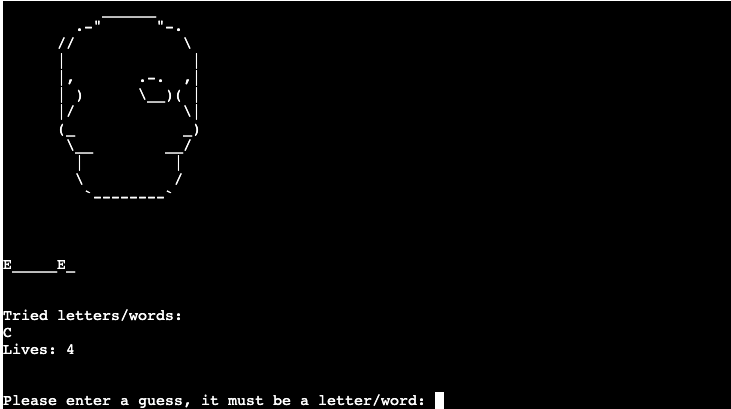
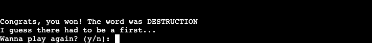
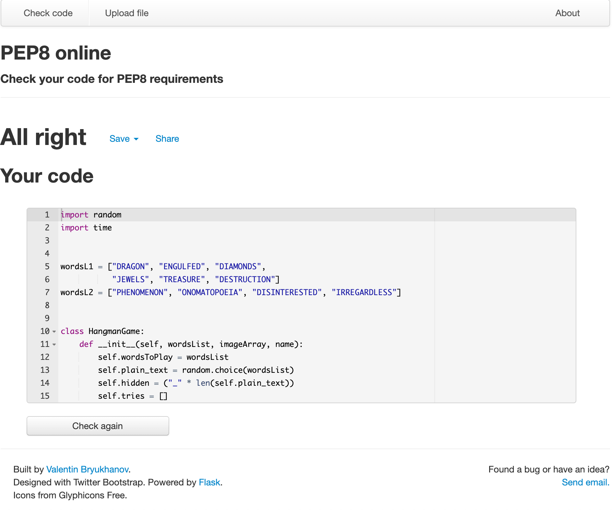

# Python Hangman Game


Live link: https://thawing-hamlet-48348.herokuapp.com/

### Table of Contents

1. [Goals](#goals)
    1. [Organisational Goals](#organisation-goals)
    2. [User Stories](#user-stories)
2. [Development](#development-plane)
    1. [Strategy](#strategy)
    2. [Planning](#planning)
    3. [Flowcharts](#flowcharts)
3. [Upgradability](#upgradability)
4. [Functions](#functions)
5. [Heckling](#heckling)
6. [Testing](#testing)
    1. [Functional Testing](#functional-testing)
    2. [Validator Testing](#validator-testing)
7. [Issues](#issues)
    1. [Unfixed Bugs](#unfixed-bugs)
    2. [Improvements](#improvements)
7. [Credits](#credits)

## Goals

### Organisation Goals

-   As a creator I want to portray a game that flows smoothly
-   As a creator I want to let the player choose between difficulties
-   As a creator I want to make sure the player enjoys their game


### User Stories

1. As a user I want to easily know the rules of the game
2. As a user I want to easily understand how to start the game
3. As a user I need to know what my score is
4. As a user I need to know when the game has been won


## Development Plane

The end goal is to create a smooth-running game that lets the player with ease dive into the world of word-guessing. 

The key is to well prepared follow the flowchart in order to answer one function at a time. 

### Strategy

The strategy is to create a clear and funny game based on the classic Hangman with a few twists. The twists being a scary/vindictive/halloween-ey theme. In order to complete the game the user stories had to be answered. 

### Planning

The planning phase was made in stages, starting off with a generalised overview and then advancing into specifics. Considering it's a terminal game no wireframes were needed and used mainly flowcharts to plan.

### Flowcharts

<br>
The over-all birds-eye view of the game is as below, in which you'll find the general flow of the game: 
<details close>
<summary>General Flowchart</summary>


</details>
<br>

## Upgradability

 The puppetmaster behind the game - in order to make the game easily upgradable with difficulties i added a hangman class which controls it:
<details close>
<summary>Class Flowchart</summary>


</details>
<br>

 In order to upgrade the game with more wordslists or difficulties all that was needed was to make the list and apply it in the parameter of the intended difficulty in the code. 

Example:

```
if choice == 'EASY':
            startGame(wordsL1, HANGMANPICS_EASY, name)
        elif choice == 'HARD':
            startGame(wordsL2, HANGMANPICS_HARD, name)
```

 This means if you'd like to add another difficulty, let's say "INSANE" all you have to do is:
1. Add a wordsL3 list of whatever words you want in the INSANE-difficulty
2. Add whatever imagery (HANGMANPICS), e.g removing or adding levels, and name it HANGMANPICS_INSANE
3. Extend the above code with to:

```
if choice == 'EASY':
            startGame(wordsL1, HANGMANPICS_EASY, name)
        elif choice == 'HARD':
            startGame(wordsL2, HANGMANPICS_HARD, name)
        elif choice == 'INSANE':
            startGame(wordsL3, HANGMANPICS_INSANE, name)
```

 Or another one: 
1. Add a wordsL4 list of whatever words you want in the IMPOSSIBLE-difficulty
2. Add whatever imagery (HANGMANPICS), e.g removing or adding levels, and name it HANGMANPICS_IMPOSSIBLE
3. Extend the above code with to:

```
if choice == 'EASY':
            startGame(wordsL1, HANGMANPICS_EASY, name)
        elif choice == 'HARD':
            startGame(wordsL2, HANGMANPICS_HARD, name)
        elif choice == 'INSANE':
            startGame(wordsL3, HANGMANPICS_INSANE, name)
        elif choice == 'IMPOSSIBLE':
            startGame(wordsL4, HANGMANPICS_IMPOSSIBLE, name)
```

## Functions

 The ability to enter your name, which personalizes the experience of the game: 


 Immediately after you input your name, the rules of the game are displayed, as well as the ability to always be able to type "exit" if you should want to quit the game: 
 (User stories: 1. As a user I want to easily know the rules of the game)


 In order to start the game, one is asked whether they want it Easy or Hard:
 (User stories: 2. As a user I want to easily understand how to start the game) 


 After choosing, the game starts, and instantly lets the player know the amount of lives, the fact that the guessed letters will be saved for them, and where to enter their letter:
 (User stories 1/3: As a user I want to easily know the rules of the game/As a user I need to know what my score is)


 
 In order to let the player know they've guessed the word incorrectly, the lives will go down as well as print the wrongly put letter in "Tried letters/words":



While the player tries to guess an entire word a warning pops up letting the user know that if they decide to be brave, they might lose a life: 


In order to let the player know they've guessed the word correctly and won, before running out of lives, the below function will display:
(User stories: 4. As a user I need to know when the game has been won)



In order to let the player know they've ran out of lives and lost the game. The user is also made aware of the actual word, as well as being able to play again:


### Heckling

Or the nicer phrasing "interaction with the player" - which is a key part of playing any game, more so in a python terminal game where the gaming experience is quite linear. So in order to bring the game alive I've added interaction in three steps: 

Three lives remaining: 


Two lives remaining:


One life remaining: 


Lastly, a complete run-through of the game: 

https://user-images.githubusercontent.com/86383017/140244395-2610532f-4ae3-4d97-87a9-42801440fa90.mov


## Testing

### Functional testing

See details [here](assets/testing.md)


### Validator Testing

Pep8 validator testing: 

<details close>
<summary>Validator Python</summary>



</details>


## Issues

- Firstly I started writing the code for the game but realised quickly I wouldn't be able to make it upgradable, thus choosing to rethink the project and came up with classes. 

- Too many print statements in order to stay within the lines. Solution was the below code, to allow new lines in one statement: 

```
print("Many have come, none have left.",
          "\nWhat makes you think you will be",
          "the first to defeat the Skull of Kol'dan?")
```

- Finding a way to match the guessed letter with the actual word in a simple way, which introduced the hidden word compared to plain text - being able to compare with plain text while keeping the hidden word hidden:

```
    return [i for i, ltr in enumerate(game.plain_text) if ltr == guess]
```

- Noticed that if you copy code directly from github via run.py and run it in pep8 it shows 
an error "No newline at end of file" - however, when forked and in IDE:s the line is there as intended. 

## Unfixed Bugs

None to my recollection.

## Improvements

- Be able to keep highscores
- Allow people to save previous scores
- Add a "hint" function at the last life.

## Deployment

GitHub:

-   The site was deployed to GitHub pages. The steps to deploy are as follows:
    -   In the GitHub repository, navigate to the Settings tab
    -   From the source section drop-down menu, select the Master Branch
    -   Once the master branch has been selected, the page will be automatically refreshed with a detailed ribbon display to indicate the successful deployment.

Heroku:

1. Create an account with Heroku
2. Create a new app whilst logged in
3. Add Buildpacks 'Python' and 'NodeJS'
4. Connect your GitHub repository via "Connect to GitHub"
5. Enable either "Automatic Deploys" or do it manually. 

## Credits

-   A general shout-out to [StackOverflow](https://stackoverflow.com/)
-   I owe all my image-compression to [ImgBot](https://imgbot.net/)

## Media

-  ASCII ART by: [ASCII.co.uk](https://ascii.co.uk/art/skulls)
-  ASCII text art by: [PATORJK](https://patorjk.com)
