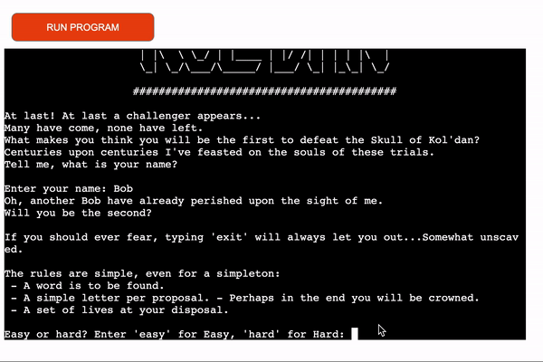
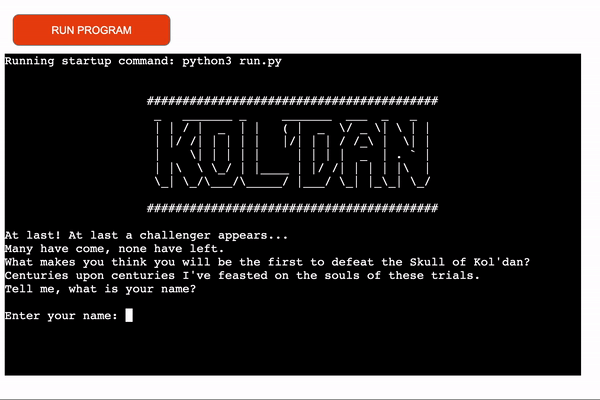
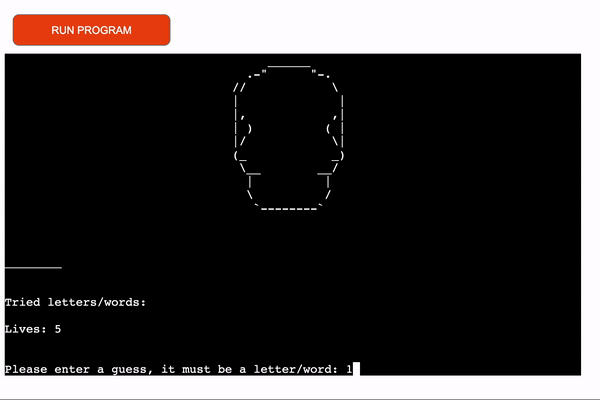
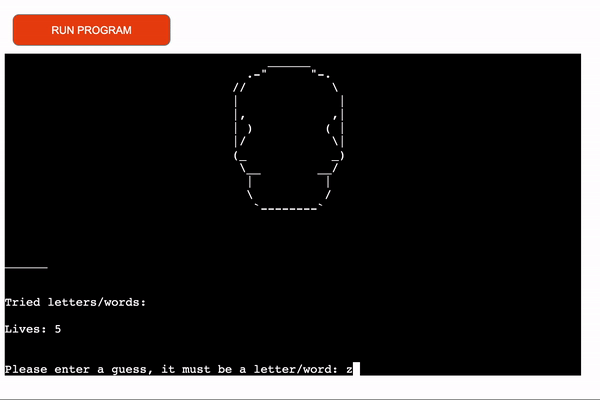
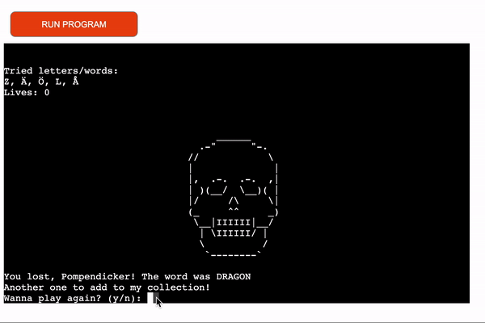

## Functional testing

### Easy

Testing to make sure you're able to choose the difficulty "easy", also in capital letters.

### Hard

Testing to make sure you're able to choose the difficulty "hard", also in capital letters.

### Name

Testing to see if the name gets saved

### Input not a letter

Testing to input not-letters

### Losing

Testing to make sure the losing function works as intended

### Play again

Testing to make sure the play_again function works as intended

### Winning

Testing win function

### Losing

Testing lose function.

Go back to [README](../README.md)